# Sistema de Inscripciones y Matriculación - App Flutter

**Repositorio del código fuente:** [https://github.com/1Said2/trabajo-bimestral-flutter-crud](https://github.com/1Said2/trabajo-bimestral-flutter-crud)

Aplicación móvil desarrollada en **Flutter (Dart)** que permite gestionar estudiantes, cursos y sus respectivas inscripciones mediante operaciones CRUD completas, consumiendo una API externa en Azure.

## Arquitectura y Tecnologías

- **Frontend**: Flutter (Dart), implementando UI dinámica con `ListView`, `StatefulWidgets`, y `FutureBuilder`.
- **Cliente de Red**: Paquete `http` nativo de Dart para peticiones asíncronas RESTful.
- **Backend**: API REST consumida mediante protocolo HTTP.

## Flujo Transaccional

La aplicación está diseñada bajo una estructura de catálogos y un flujo transaccional maestro-detalle integrados en un `BottomNavigationBar`:

1. **Gestión de Catálogos**: Permite realizar operaciones CRUD sobre las entidades base (Estudiantes y Cursos).
2. **Proceso de Inscripción**:
   - Al iniciar una matrícula, la app permite elegir un estudiante desde una lista desplegable, fijar la fecha, y agregar cursos usando *checkboxes*.
3. **Interacción con UI**: La app interactúa con la API REST enviando y recibiendo JSON, mostrando notificaciones en pantalla (`SnackBar`) y diálogos de confirmación (`AlertDialog`).

## Capturas Generales del Sistema

| Historial de Inscripciones | Gestión de Estudiantes | Gestión de Cursos |
| :---: | :---: | :---: |
|  | 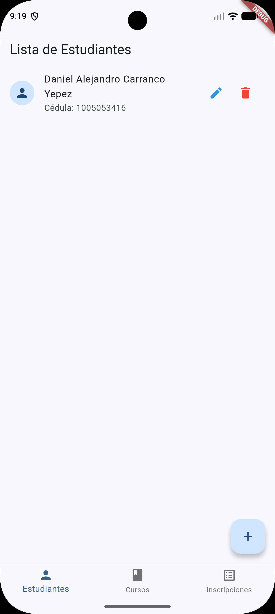 | 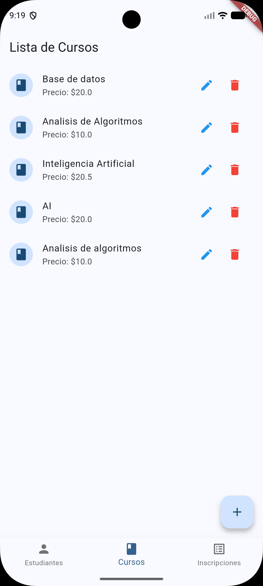 |

---

## Flujo de Operaciones (CRUD)

### Módulo: Estudiantes

**1. Listado de Estudiantes (GET)**

**2. Creación de Estudiante (POST)**
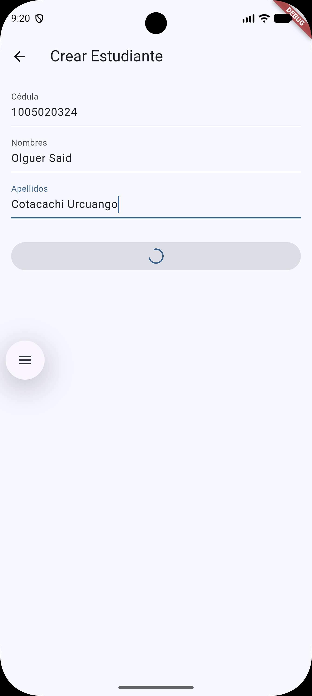

**3. Edición de Estudiante (PUT)**
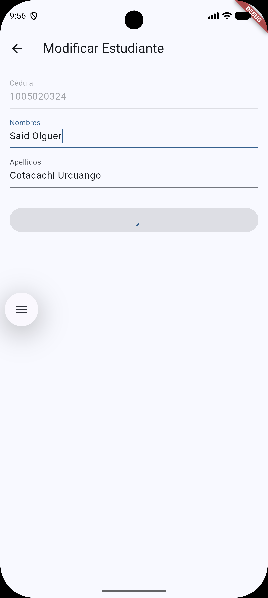

**4. Eliminación de Estudiante (DELETE)**
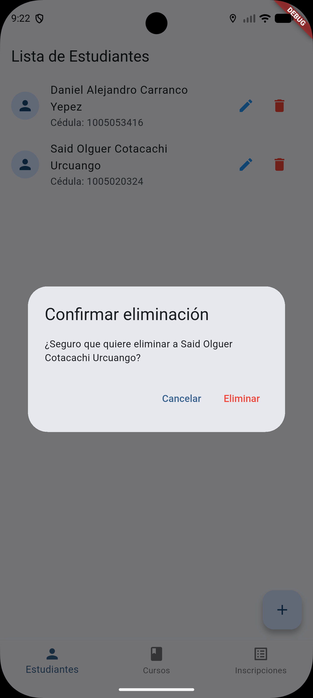

---

### Módulo: Cursos

**1. Catálogo de Cursos (GET)**

**2. Alta de Curso (POST)**
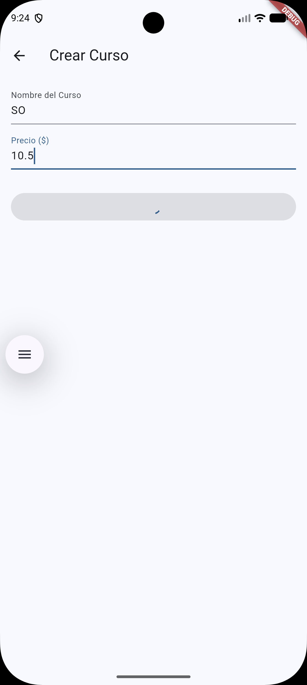

**3. Actualización de Curso (PUT)**
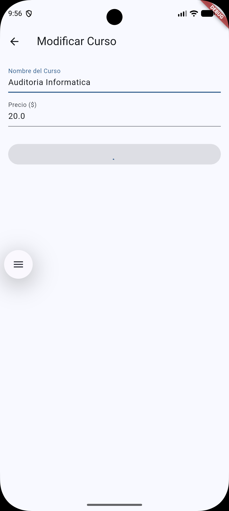

**4. Baja de Curso (DELETE)**
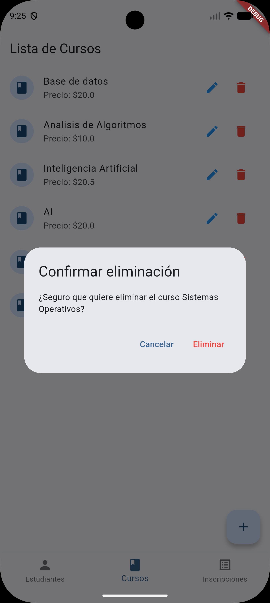

---

### Módulo: Inscripciones (Maestro-Detalle)

**1. Historial de Inscripciones (GET)**

**2. Nueva Inscripción (POST)**
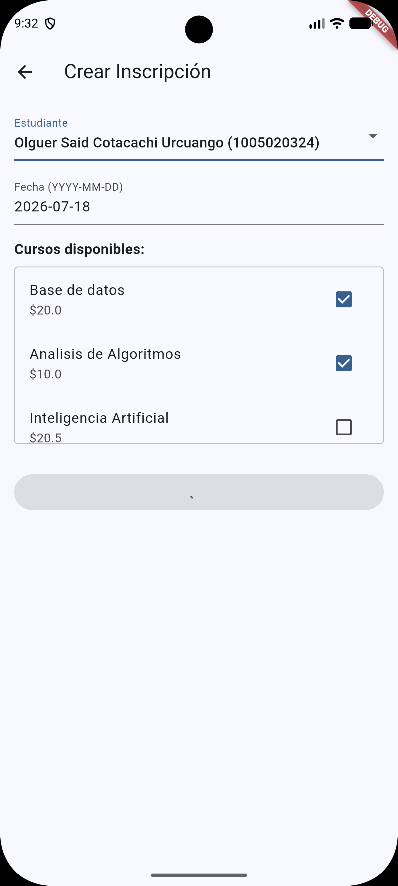

**3. Modificación de Inscripción (PUT)**
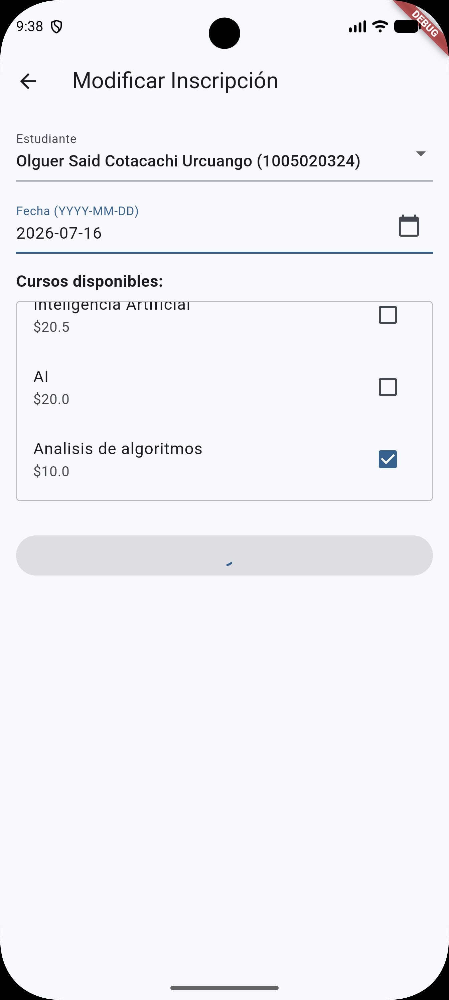

**4. Anulación de Inscripción (DELETE)**
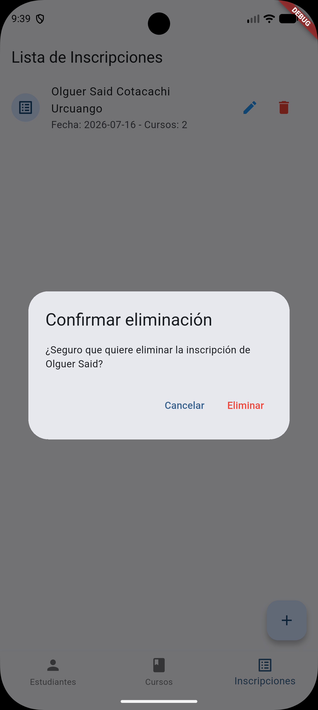